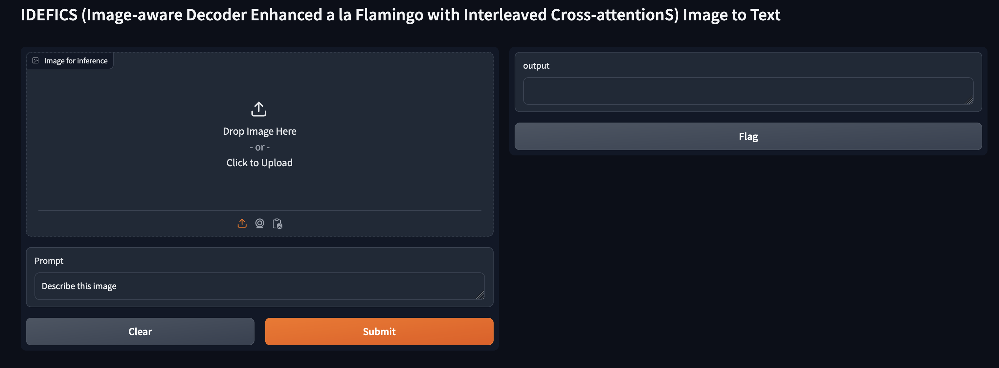

# Multimodel LLM (MLLM)

We all know Large Language Models primarily were focused on solving problems with data in one mode (single modality) – text (translation, language translation, summarization etc.), image (object detection, image classification, image ranking etc.), video or audio (transcribing, speech recognition). 

To achieve near human level intelligence for these LLM’s, they need to understand data in two more modes, and the term multi-modality. Humans can read and write text, and see images and video and interpret them efficiently. Being able to work with multimodal data is essential for AI to operate in real-world.


We are using [idefics-9b-instruct](https://huggingface.co/HuggingFaceM4/idefics-9b-instruct) (IDEFICS (Image-aware Decoder Enhanced à la Flamingo with Interleaved Cross-attentionS) is an open-access reproduction of Flamingo).
IDEFICS was trained on a mixture of openly available datasets like Wikipedia, Public Multimodal Dataset, and LAION, as well as a new 115B token dataset called OBELICS that we created.


This code builds a UX using Graio tool, that accepts image and text box to ask question to the model.



To build this code, and model clone the repository, to execute the platform it is good to be running in a GPU enabled EC2 or instance:
* [EC2 Wtih 4 GPU Intance - g4dn.12xlarge](https://instances.vantage.sh/aws/ec2/g4dn.12xlarge)
* [EC2 Wtih 1 GPU Intance - g4dn.8xlarge](https://instances.vantage.sh/aws/ec2/g4dn.8xlarge)

Once instance is created, login using ssh, activate pytorch coda environment

```
 source activate pytorch

```

Run the code

```
python inference.py
```

use the public url to access the app

```
Running on public URL: https://<uuid for the url access>.gradio.live
```

Select an image (PNG/JPG) etc and then click on submit to get text intepretation of the image


### Create a Juypter Lab instance in EC2

```
pip install jupyterlab
```

```
jupyter notebook --generate-config
```
```
sudo vi /etc/systemd/system/jupyterlab.service
```
```
[Unit]
Description=JupyterLab
After=syslog.target network.target
[Service]
User=root
Environment="PATH=/opt/conda/envs/pytorch/bin:/opt/conda/condabin:/opt/amazon/openmpi/bin:/opt/amazon/efa/bin:/opt/conda/bin:/usr/local/cuda/bin:/usr/local/cuda/include:/usr/libexec/gcc/x86_64-redhat-linux/7:/opt/aws/bin:/usr/local/bin:/usr/bin:/usr/local/sbin:/usr/sbin:/home/ec2-user/.local/bin:/home/ec2-user/bin"
ExecStart=/opt/conda/envs/pytorch/bin/python -m jupyterlab --notebook-dir=/home/ec2-user/notebook --ip 0.0.0.0 --port 8888 --no-browser --allow-root --NotebookApp.token='' --NotebookApp.password=''
[Install]
WantedBy=multi-user.target
```
```
sudo vi /etc/systemd/system/jupyterlab.service
sudo systemctl daemon-reload
sudo systemctl start jupyterlab.service
sudo systemctl status jupyterlab.service
```